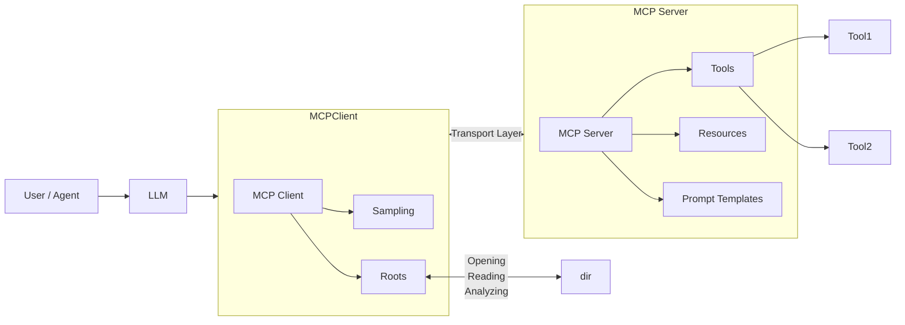
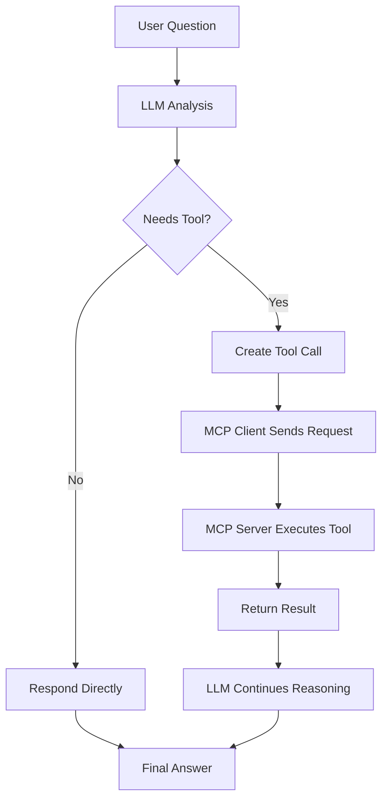
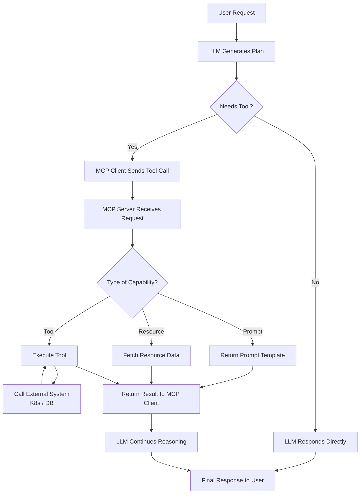

# 3️⃣ Architecture and Flow

## Architecture




---

## Request Lifecycle

### Request Flow
```
User → Model → Tool Call → MCP Server → Result → Model → User
```

1. The **user** asks a question.
2. The **model** decides it needs a tool (e.g., "add two numbers").
3. The model calls the **tool** via the MCP client.
4. The **MCP server** runs the tool and returns the result.
5. The model receives the result, reasons, and responds to the user.


1. User: *"What is 7 + 12?"*
2. LLM decides it needs `add(7, 12)`
3. Client sends `tools/call` → `{"name": "add", "arguments": {"a": 7, "b": 12}}`
4. Server runs `add(7, 12)` → `19`
5. Client returns `19` to the LLM
6. LLM responds: *"7 + 12 = 19"*



#### More Complete Flow




# 4️⃣ Example: Calculator

User asks:

> What is 7 + 12?

LLM generates structured tool call:

```json
{
  "name": "add",
  "arguments": {"a": 7, "b": 12}
}
```

Server executes:

```python
add(7, 12) → 19
```

Final answer:

> 7 + 12 = 19

---

### Client Options

- **Cursor** or **Claude Desktop** – full LLM integration
- **FastMCP Client** – each example ships a `client.py` using `fastmcp.Client`
- **`examples/01-calculator/demo.py`** – full loop with a simulated LLM


# Teaching Mode

Each example directory contains:

* `server.py`
* `client.py`
* `demo.py` (simulated LLM loop)

The simulated LLM allows you to understand MCP **without needing a real API key**.

---

## Reference
> FastMCP provides both server and client. See [gofastmcp.com](https://gofastmcp.com).


**Next:** [04 – FastMCP Explained](04-fastmcp-explained.md)